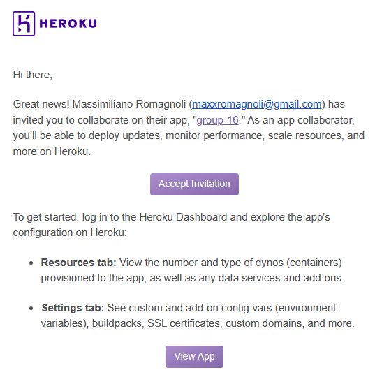

# Start backend

## Running the backend
(Through terminal)
1. Ensure you are in the root of the project (on same level as app.py and requirements.txt)
2. Install requirements: `pip install -r requirements.txt`
3. go into frontend/src/game.js and make sure 43 is correct for the computer you're on
  (127.0.0.1:5000 --> for mac
  localhost:5000 --> for windows)
3. Run the backend: `flask run`

## Running the tests
(Through terminal)
1. Ensure you are in the root of the project (on same level as app.py and requirements.txt)
2. Install requirements: `pip install -r requirements.txt`
3. Run the tests: `pytest`

# Deploy to Heroku

### Requirements (Only first time)
* On the invitation email I sent you click *Accept Invitation* and create a Heroku account.
  * You will probably need to enable two-factor authentication with Salesforce Authenticator
* Download Heroku CLI from https://devcenter.heroku.com/articles/heroku-cli
  * You will be prompted to access your Heroku account.
* Make sure Heroku is in your PATH by running `heroku --version`
  * Note: you might need to restart your IDE after installing Heroku
* Run `heroku git:remote -a group-16`
  * Connects your local repo to the remote hosted in Heroku

### Build React app
* First change the following lines:
  * In `frontend/src/index.js Line 11` > Swap the `BACKEND_ADDRESS` constants
    * This will allow the React to access the deployed backend instead of localhost
  * In `frontend/.gitignore Line 13` > Comment out `/build`
    * To allow build files to be pushed to Heroku (conversely, this needs to be toggled when pushing to our repo on Gitlab)
  * In `app.py Line 3 & 7` > Comment out CORS
* Generate build files for production using `npm run build`
  * This will basically pack the React application for production so that it can be retrieved by the backend when deployed
* IMPORTANT: commit all changes you want to be deployed before pushing
  * So do `commit` and `add` as needed
* Run `git push heroku your-branch-name:master`
  * This will take a bit. If you see there is no error the app should be deployed.

### Put back to development
* Once you are done, remember to change back the lines for development.

